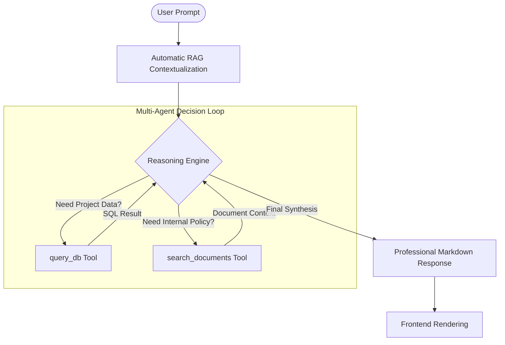
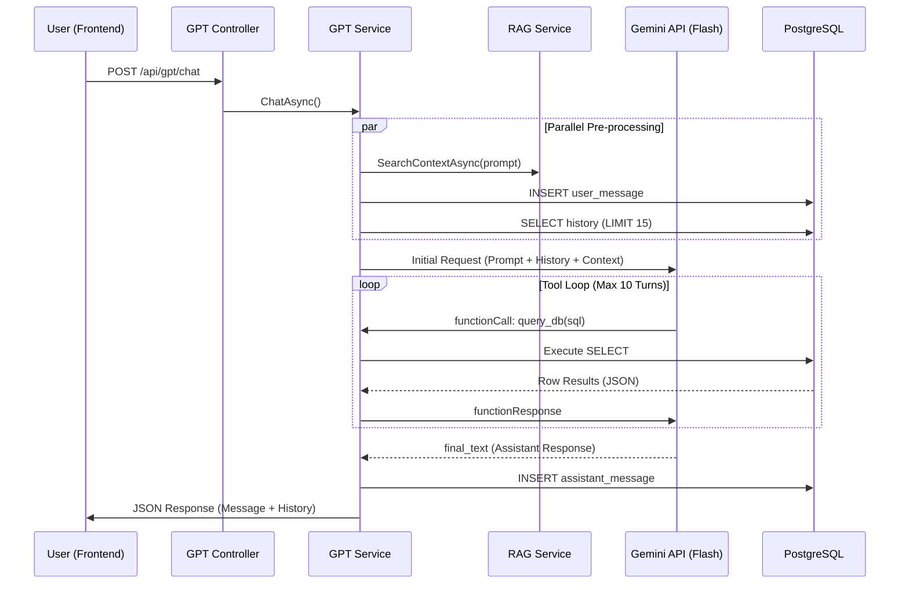

# NIBSS GPT - Executive Implementation Deep-Dive

NIBSS GPT is a professional-grade, multi-agent intelligence engine designed to bridge the gap between static IT Governance data and proactive operational awareness within NIBSS.

## 1. Core Intelligence Flow (Multi-Agent Reasoning)

The system is powered by **Google Gemini 2.0 Flash**, configured in a recursive "Reasoning Loop" that allows the AI to act as an agent rather than a simple chatbot.

### A. The Chain of Thought (CoT) Flow

## 2. Technical Component Breakdown

### A. Intelligence Engine (The "Brain")
- **Model**: `gemini-1.5-flash-latest` (Switched from 2.0-flash-001 for better free-tier quota reliability).
- **Latency Strategy**: Optimized with a `0.2 temperature` for high precision in SQL generation.
- **Protocol**: Implements the 2026 Gemini Protocol, requiring `thoughtSignature` preservation during multi-turn tool calls.
- **Fail-safe**: Implements a 3-tier retry logic for `429 (Too Many Requests)` with exponential backoff.

### B. RAG Pipeline (Retrieval-Augmented Generation)
The system creates a "Living Knowledge Base" by processing corporate documentation:
- **Ingestion**: Supports `.pdf` (via PdfPig), `.docx` (via OpenXML), and `.txt`.
- **Chunking Strategy**: 
    - **Size**: 1,000 characters.
    - **Overlapping**: 200 characters (ensures semantic context is not lost at the boundary).
- **Search Logic**: Uses a weighted ILIKE ANY keyword vectorization against the `gpt_document_chunks` table, retrieving the top 5 most relevant segments per query.

### C. Tool Ecosystem (The "Hands")
| Tool | Purpose | Capability |
| :--- | :--- | :--- |
| **`query_db`** | Real-time Operations | Generates & executes SQL against live tickets, incidents, and movement logs. |
| **`search_documents`** | Governance Context | Accesses indexed business requirements, CAB policies, and SLAs. |

## 3. Database Architecture (The "Memory")

The backend utilizes PostgreSQL with a specialized schema for GPT operations:

| Table | Column | Description |
| :--- | :--- | :--- |
| **`gpt_conversations`** | `title`, `user_id` | Manages chat session metadata. |
| **`gpt_messages`** | `role`, `content` | History of Prompts, Tool Calls, and AI Responses. |
| **`gpt_documents`** | `title`, `uploaded_by` | Tracks source documents in the knowledge base. |
| **`gpt_document_chunks`**| `content`, `index` | The granular segments used for RAG. |

## 4. Sequence of a Single Interaction

## 5. Security Guardrails & Governance
- **SQL Sanitization**: Every system-generated query is strictly validated. Destructive operations (`UPDATE`, `DELETE`, `DROP`) are blocked at the service level.
- **Domain Confinement**: The System Prompt explicitly restricts the AI to IT Governance (CAB, SLA, SLR), Software Dev (JIRA, Sprints), and Service Delivery (Incidents).
- **Auditability**: 100% of tool-calling reasoning is saved in the database for post-incident review.

## 6. Proprietary Data Shielding

The NIBSS GPT architecture is designed with a "Privacy First" retrieval model that prevents the exposure of the full proprietary dataset to the Gemini LLM.

### A. Local-First Processing
- **Backend Isolation**: All document parsing (PDF, DOCX) and text chunking occur locally within the NIBSS backend infrastructure. The Gemini LLM has zero visibility into the raw files or the full document library.
- **On-Premise Indexing**: The keyword-based index and `gpt_document_chunks` are stored in the local NIBSS PostgreSQL instance. No data is shared with external services during the indexing phase.

### B. Selective Context Infusion ("Need-to-Know")
Instead of feeding the entire corporate knowledge base to the LLM, the system uses a **Selective Retrieval** mechanism:
1.  **Semantic Narrowing**: The `RagService` acts as a firewall. It performs a local search and selects only the **top 5 most relevant 1,000-character snippets** related to the specific user query.
2.  **Limited Exposure**: Only these specific fragments (representing <0.1% of the total dataset) are sent to the Gemini API as temporary context.
3.  **Stateless Reasoning**: Data sent to the Gemini API is processed as a stateless request. Because of the granular chunking, the LLM cannot reconstruct full sensitive documents from the isolated snippets it receives.

### C. The "Agentic Firewall"
The AI "Agent" never has direct access to the documentation table. It must request data through the internal `search_documents` function call, which is intermediated by the `RagService`. This ensures that even during tool execution, only filtered and relevant data fragments are exposed.

---
*Maintained by Antigravity for NIBSS Intelligence Operations.*
