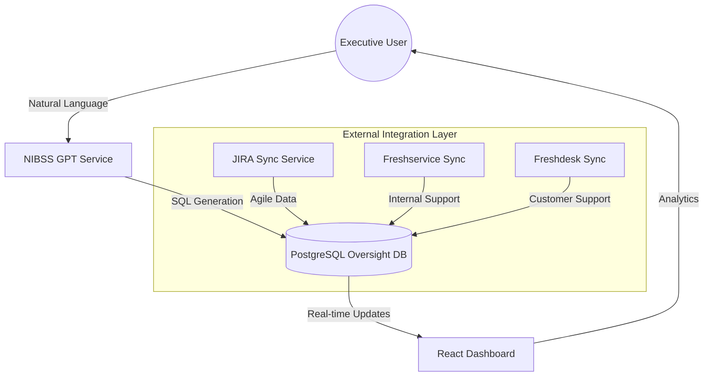

# NIBSS Oversight Portal 🛡️

[](https://vercel.com)
[](https://gemini.google.com)
[](https://github.com/bigm-o/Oversight-Portal)

> **Enterprise-grade intelligence, analytics, and governance for the Nigeria Inter-Bank Settlement System.**

---

## 📖 Project Overview

The **NIBSS Oversight Portal** is a sophisticated Internal Governance and Service Delivery platform. It bridges the gap between high-velocity Agile development (JIRA) and enterprise service support (Freshworks), providing real-time visibility into operational health, SLA compliance, and team performance.

Built with a **Privacy-First** approach, the portal features a specialized AI Engine (**NIBSS GPT**) that allows executives to query complex datasets using natural language without compromising sensitive financial data structures.

---

## 🤖 NIBSS GPT: The Intelligence Engine

NIBSS GPT is the heart of the oversight layer. Unlike generic AI, it is strictly context-aware and operates within the NIBSS Governance Mandate.

- **High-Speed RAG**: Ingests and indexes business documentation for instant policy lookup.
- **Natural Language to SQL**: Safely translates human queries into optimized PostgreSQL `SELECT` statements.
- **Thought Reflection**: Uses a "Chain of Thought" reasoning process to validate its own logic before querying the database.
- **Governance Guardrails**: Explicitly refuses out-of-scope requests, maintaining a professional corporate persona.

---

## 🛠️ Technology Stack

### Frontend & UI/UX
- **React 18** + **TypeScript** for type-safety and scale.
- **Vite** for ultra-fast build and development cycles.
- **Tailwind CSS** for a premium, custom-branded interface.
- **Motion (Framer)** for fluid, boardroom-ready animations.
- **Lucide & Radix UI** for accessible, high-fidelity components.

### Backend & Core Logic
- **.NET 8 Web API**: High-performance, cross-platform server architecture.
- **Dapper ORM**: Micro-ORM for high-speed, raw SQL performance.
- **PostgreSQL**: Robust relational data storage with Full-Text Search.
- **SignalR**: Real-time push notifications and dashboard updates.

---

## 📉 Operational Intelligence (DP Logic)

The portal implements the proprietary **NIBSS Delivery Points (DP)** system to objectively measure operational velocity.

| Work Type | Formula | Weighting Factors |
| :--- | :--- | :--- |
| **Agile Tickets (JIRA)** | `DP = 10 × (C + R)` | Complexity (C), Risk (R) |
| **Service Incidents** | `DP = 5 × (C + R)` | Escalation & Impact |

*C & R are ranked on a scale of 1-4, ensuring that high-risk governance-critical tasks are prioritized.*

---

## 🏗️ Technical Architecture



---

## 📦 Deployment & Setup

### Vercel Deployment (Frontend)
This project is pre-configured for **Vercel**. Connect your GitHub repository to Vercel for automatic CI/CD on the `main` branch.

**Required Environment Variables (Vercel):**
- `VITE_API_BASE_URL`: The URL of your deployed .NET Backend.

### Local Development
1. **Clone & Install**
   ```bash
   git clone https://github.com/bigm-o/Oversight-Portal.git
   cd Oversight-Portal
   ```
2. **Setup Database**
   Import the foundation schema located in `backend/Database/schema.sql`.
3. **Run API**
   ```bash
   cd backend/TicketTracker.Api
   dotnet run
   ```
4. **Run Frontend**
   ```bash
   cd "frontend/Nibss Tracker UI"
   npm install && npm run dev
   ```

---

## 🛡️ Governance & Audit Policy
- **Infinite Data Retention**: The system is designed for 100% auditability. Deletion is restricted to temporary logs.
- **Role-Based Access (RBAC)**: Fine-grained permissions for Admins and Governance Officers.
- **Audit Logs**: Every GPT query and data modification is timestamped and attributed.

---
*Developed for the Nigeria Inter-Bank Settlement System PLC.*
